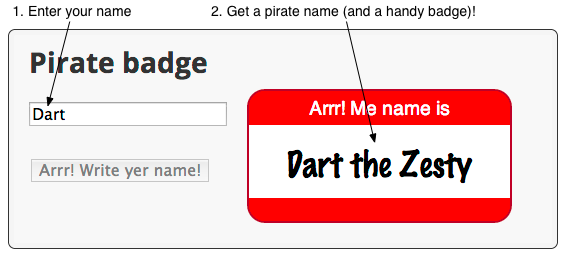
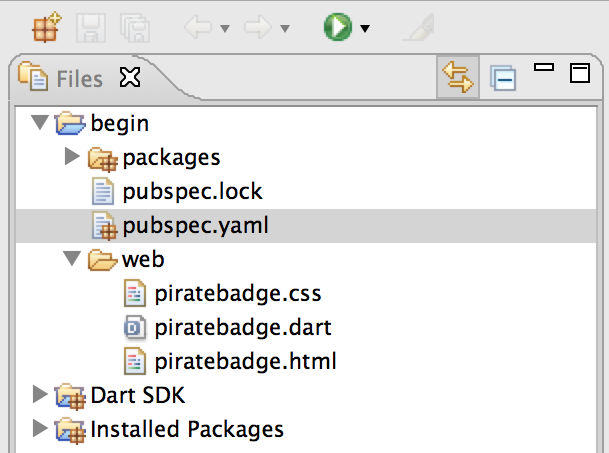

<toc-element></toc-element>

This codelab features a simple app
that produces a name badge,
suitable for wear at a pirate convention.
The point is not to dazzle you with the app's appearance or features,
but to teach you about the Dart language, core libraries, and tools.

<figure>
  
  <figcaption>The final app</figcaption>
</figure>

Now that you know what you'll be building,
it's time to get the code
and take a look at it.

### Start the editor

Throughout this codelab,
you use Dart Editor to edit and run your web app.

  

    &rarr; If you don't already have Dart Editor, download it by
    clicking the <b>Download Dart + Editor</b> button
    on the following page:
  

  <blockquote>
    <a href="https://www.dartlang.org/tools/download.html"
    target="_blank"><b>Dart download page</b></a>
  </blockquote>

  &rarr; Start Dart Editor.
  If you have problems, see
  <a href="https://www.dartlang.org/tools/editor/troubleshoot.html"
  target="_blank">Troubleshooting Dart Editor</a>.

  
&rarr; Start Dart Editor by clicking the Dart logo
  at the bottom of your computer screen:

  

### Open the sample app

&rarr; In Dart Editor,
use **File > Open Existing Folder...**
to open the <b><io-location-string noclone="true"></io-location-string></b> directory.

 

<figure>
  
  <figcaption><io-location-string noclone="true"></io-location-string> contains the files and directories for your app.</figcaption>
</figure>

<aside class="callout">
<b>Note:</b>
If you see red Xs at the left of the
filenames or if the <code>packages</code> directory is missing,
the packages are not properly installed.
Right-click <code>pubspec.yaml</code> and select <b>Pub Get</b>.
</aside>

Key information:

* The `packages` directory, `pubspec.yaml`, and `pubspec.lock` are
  related to package dependencies.
  This project has all the dependencies set up for you.
  Dart Editor automatically installs the necessary packages.

* **Dart SDK** contains the source code for all of the functions,
  variables, and classes provided by the Dart Software Development Kit.

* **Installed Packages** contains the source code for all of the functions,
  variables, and classes for the additional libraries that this application depends on.
