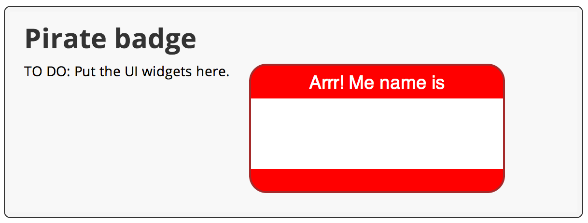

<toc-element></toc-element>

### Look in the web directory

&rarr; In Dart Editor, expand the **`begin`** directory
and then the **`web`** directory
by clicking the little arrows
 to the left of their names.

The `web` directory contains `piratebadge.html`, `piratebadge.dart`,
and `piratebadge.css`.

### Open the files

&rarr;  Open `piratebadge.html` and `piratebadge.dart`,
by double-clicking each filename in Dart Editor.

### Review the code

&rarr; Get familiar with the HTML and the Dart code for the skeleton version of the app.

#### piratebadge.html

IMPORT('src/begin/web/piratebadge.html', 'initial_html')

Key information:

* During this code lab,
  all the changes you make to `piratebadge.html` are within
  the &lt;div&gt; element identified with the class `widgets`.

* In later steps,
  the &lt;span&gt; element with the ID `badgeName`
  is programmatically updated by the Dart code
  based on user input.

* The first &lt;script&gt; tag identifies
  the main file that implements the app.
  Here, it's the `piratebadge.dart` file.

* The Dart Virtual Machine (Dart VM) runs Dart code natively.
  The Dart VM is built into Dartium,
  a special build of the Chromium browser in which you can run Dart apps natively.

* The `packages/browser/dart.js` script checks for native Dart support
  and either bootstraps the Dart VM or loads compiled JavaScript instead.

#### piratebadge.dart

IMPORT('https://raw.githubusercontent.com/thagikura/dart-start-codelab/master/src/begin/web/piratebadge.dart', 'initial_dart')

Key information:

* This file contains the single entry point for the app&mdash;the `main()` function.
  The &lt;script&gt; tags in the `piratebadge.html` file start the application
  by running this function.

* The `main()` function is a top-level function.

* A top-level variable or function is one that is declared outside
  a class definition.

### Run the app

&rarr; In Dart Editor, right-click `piratebadge.html`
and select **Run in Dartium**.

<figure>
  
  <figcaption>Select Run in Dartium</figcaption>
</figure>

<b>Note:</b> The first time you run the app, you might see a dialog
asking if it's OK for a remote device to connect to and run your Dart apps.
Click <b>OK</b>.

Dart Editor launches _Dartium_, a special build of Chromium
that has the Dart Virtual Machine built in,
and loads the `piratebadge.html` file.
The `piratebadge.html` file loads the app
and calls the `main()` function.

You should see a TO DO comment on the left
and a red and white name badge on the right.

<figure>
  
  <figcaption>Your running app should look like this</figcaption>
</figure>
