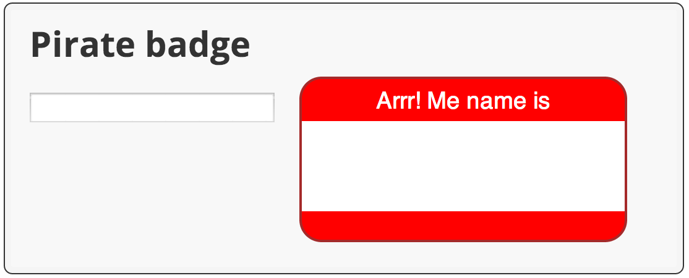

<toc-element></toc-element>

<aside class="callout">
<strong>Note:</strong> Throughout this code lab,
continue to <strong>edit the files in <code>begin</code>.</strong>
You can use the files in the other directories to compare to your code
or to recover if you get off track.
</aside>

### Edit piratebadge.html

&rarr; Add a new &lt;div> containing an &lt;input&gt; tag to the HTML code
within the `widgets` &lt;div&gt;.

    ...
IMPORT('https://github.com/marcacohen/codelab-test/raw/master/widgets.html', 'initial_html')
    ...

Key information:

* The ID for the input element is `inputName`.
Dart uses CSS selectors, such as `#inputName`,
to get elements from the DOM.

### Edit piratebadge.dart

&rarr; Import the `dart:html`
library at the top of `piratebadge.dart`
(below the copyright).

    import 'dart:html';

Key information:

* This imports _all_ classes and other resources from dart:html.

* Don't worry about bloated code.
  The build process performs tree-shaking to help minimize code.

* The dart:html library contains the classes for all DOM element types,
  in addition to functions for accessing the DOM.

* Later you'll use import with the `show` keyword,
  which imports only the specified classes.

* Dart Editor helpfully warns you that the import is unused.
  Don't worry about it. You'll fix it in the next step.

&rarr; Register a function named `updateBadge`
to handle input events on the input field.

    // In main():
    querySelector('#inputName').onInput.listen(updateBadge);

Key information:

* The `querySelector()` function, defined in
  dart:html, gets the specified element from the DOM.
  Here, the code uses the selector `#inputName`
  to specify the input field.

* The object returned from `querySelector()` 
  _is_ the DOM element object.

* Mouse and keyboard events are served over a stream.

* A Stream provides an asynchronous sequence of data.
  Using the `listen()` method, a stream client
  registers a callback function that gets called when
  data is available.

* `onInput.listen()` listens to the text field's event stream for input events.
  When such an event occurs, `updateBadge()` is called.

* An input event occurs when the user presses a key.

* You can use either single or double quotes to create a string.

* Dart Editor warns you that the function doesn't exist.
  Let's fix that now.

&rarr; Implement the event handler.
You can put this function at the end of `piratebadge.dart`.

    ...

    void updateBadge(Event e) { 
      querySelector('#badgeName').text = e.target.value;
    }

Key information:

* This function sets the text of the `badgeName` element from the value of the input field.

* `Event e` is the argument to the updateBadge function.
  The argument's name is `e`; its type is `Event`.

* You can tell that `updateBadge()` is an event handler because
  its parameter is an `Event` object.

* The element that generated the event, the input field, is `e.target`.

* Note the warning symbol next to this line of code in Dart Editor.
  `e.target` is typed as an `EventTarget`,
   which does not have a `value` property.

&rarr; Remove the warning by specifying a type for `e.target`.

    void updateBadge(Event e) { 
      querySelector('#badgeName').text =
          (e.target as InputElement).value;
    }

Key information:

* In this example, `e.target` is the input element
  that generated the event.

* The `as` keyword typecasts `e.target` to an
  `InputElement` to silence warnings from Dart Editor.

### Run the app

&rarr; Save your files with **File > Save All**.

&rarr; Run the app by right-clicking `piratebadge.html` and
selecting **Run in Dartium**.

&rarr; Compare your app to this screenshot.

<figure>
  
  <figcaption>Your app should look like this</figcaption>
</figure>

&rarr; Type in the input field.

The text you type should also appear in the badge.

#### Problems?

Check your code against the files in <io-location-string noclone="true" starterpath="/step3"></io-location-string>.
