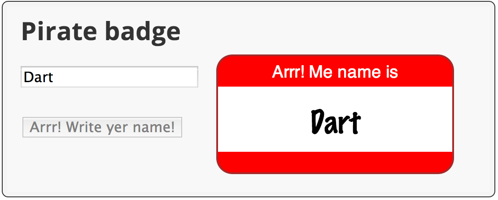

<toc-element></toc-element>

### Edit piratebadge.html

&rarr; Add a &lt;button&gt; tag below the input field.

    ...
    <!-- In the "widgets" div -->
      ...
      <!-- Add a button div *after* the input element's div -->
      

        <button id="generateButton">Aye! Gimme a name!</button>
      

    
 <!-- end of the "widgets" div -->
    ...

Key information:

* The button has the ID `generateButton` so
the Dart code can get the element.

### Edit piratebadge.dart

&rarr; Below the import, declare a top-level variable to hold the `ButtonElement`.

    import 'dart:html';

    ButtonElement genButton;

Key information:

* ButtonElement is one of many different kinds of DOM elements
provided by the dart:html library.

* Variables, including numbers, initialize to null if no value is provided.

&rarr; Wire up the button with an event handler.

    void main() {
      ...
      genButton = querySelector('#generateButton');
      genButton.onClick.listen(generateBadge);
    }

Key information:

* `onClick` registers a mouse click handler.

&rarr; Add a top-level function that changes the name on the badge.

    ...

    void setBadgeName(String newName) {
      querySelector('#badgeName').text = newName;
    }

Key information:

* The function updates the HTML page with a new name.

&rarr; Implement the click handler for the button.

    ...

    void generateBadge(Event e) {
      setBadgeName('Anne Bonney');
    }

Key information:

* This function sets the badge name to `Anne Bonney`.

&rarr; Modify `updateBadge()` to call `setBadgeName()`.

    void updateBadge(Event e) {
      String inputName = (e.target as InputElement).value;
      setBadgeName(inputName);
    }

Key information:

* Assign the input field's value to a local string.

&rarr; Add a skeleton if-else statement to `updateBadge()`.

    void updateBadge(Event e) {
      String inputName = (e.target as InputElement).value;
      setBadgeName(inputName);
      if (inputName.trim().isEmpty) {
        // To do: add some code here.
      } else {
        // To do: add some code here.
      }
    }

Key information:

* The `String` class has useful functions and properties 
for working with string data,
such as `trim()` and `isEmpty`.

* String comes from the `dart:core` library,
which is automatically imported into every Dart program.

* Dart has common programming language constructs like `if`-`else`.

&rarr; Now fill in the if-else statement to modify the button as needed.

    void updateBadge(Event e) {
      String inputName = (e.target as InputElement).value;
      setBadgeName(inputName);
      if (inputName.trim().isEmpty) {
        genButton..disabled = false
                 ..text = 'Aye! Gimme a name!';
      } else {
        genButton..disabled = true
                 ..text = 'Arrr! Write yer name!';
      }
    }

Key information:

* The cascade operator (`..`) allows you to perform multiple
operations on the members of a single object. 

* The `updateBadge()` code uses the cascade operator
to set two properties on the button element.
The result is the same as this more verbose code:

    genButton.disabled = false;
    genButton.text = 'Aye! Gimme a name!';

### Run the app

&rarr; Save your files with **File > Save All**.

&rarr; Run the app by right-clicking `piratebadge.html` and
selecting **Run in Dartium**.

&rarr; Compare your app to this screenshot.

<figure>
  
  <figcaption>Your app should look like this</figcaption>
</figure>

&rarr; Type in the input field.
Remove the text from the input field.
Click the button.

#### Problems?

Check your code against the files in <io-location-string noclone="true" starterpath="/step4"></io-location-string>.
