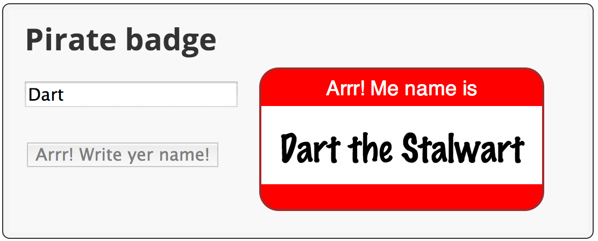

<toc-element></toc-element>

### Edit piratebadge.dart

&rarr; Add an import to the top of the file.

    import 'dart:html';
    import 'dart:math' show Random;

Key information:

* Using the `show` keyword,
you can import only the classes, functions, or properties you need.

* `Random` provides a random number generator.

&rarr; Add a class declaration to the bottom of the file.

    ...

    class PirateName {
    }

Key information:

* The class declaration provides the class name.

&rarr; Create a class-level Random object.

    class PirateName {
      static final Random indexGen = new Random();
    }

Key information:

* `static` defines a class-level field. That is,
the random number generator is shared with all
instances of this class.

* Dart Editor italicizes the names of class-level fields and methods.

* Use `new` to call a constructor.

&rarr; Add two instance variables to the class—one
for the first name and one for the appellation.

    class PirateName {
      static final Random indexGen = new Random();
      String _firstName;
      String _appellation;
    }

Key information:

* Private variables start with underscore (`_`).
  Dart has no `private` keyword.

&rarr; Create two static lists within the class
that provide a small collection of names and appellations to choose from.

    class PirateName {
      ...
      static final List names = [
        'Anne', 'Mary', 'Jack', 'Morgan', 'Roger',
        'Bill', 'Ragnar', 'Ed', 'John', 'Jane' ];
      static final List appellations = [
        'Jackal', 'King', 'Red', 'Stalwart', 'Axe',
        'Young', 'Brave', 'Eager', 'Wily', 'Zesty'];
    }

Key information:

* `final` variables cannot change.

* Lists are built into the language.
These lists are created using list literals.

* The `List` class provides the API for lists.

&rarr; Provide a constructor for the class.

    class PirateName {
      ...
      PirateName({String firstName, String appellation}) {
        if (firstName == null) {
          _firstName = names[indexGen.nextInt(names.length)];
        } else {
          _firstName = firstName;
        }
        if (appellation == null) {
          _appellation = appellations[indexGen.nextInt(appellations.length)];
        } else {
          _appellation = appellation;
        }
      }
    }

Key information:

* Constructors have the same name as the class.

* The parameters enclosed in curly brackets (`{` and `}`)
are optional, named parameters.

* The `nextInt()` function gets a new random integer
from the random number generator.

* Use square brackets (`[` and `]`) to index into a list.

* The `length` property returns the number of items in a list.

* The code uses a random number as an index into the list.

&rarr; Provide a getter for the pirate name.

    class PirateName {
      ...
      String get pirateName =>
        _firstName.isEmpty ? '' : '$_firstName the $_appellation';
    }

Key information:

* Getters are special methods that provide read access to an object’s properties.

* The ternary operator `?:` is short-hand for an if-then-else statement.

* String interpolation
(`'$_firstName the $_appellation'`)
lets you easily build strings from other objects.

* The fat arrow (` => expr; `) syntax is a shorthand for `{ return expr; }`.

&rarr; Modify the function `setBadgeName()` to use a PirateName instead of a String:

    void setBadgeName(PirateName newName) {
      querySelector('#badgeName').text = newName.pirateName;
    }

Key information:

* This code calls the getter to get the PirateName as a string.

&rarr; Change `updateBadge()` to generate a PirateName based on the input field value.

    void updateBadge(Event e) {
      String inputName = (e.target as InputElement).value;
      
      setBadgeName(new PirateName(firstName: inputName));
      ...
    }

Key information:

* The call to the constructor provides a value for one optional named parameter.

&rarr; Change `generateBadge()` to generate a PirateName instead of using `Anne Bonney`.

    void generateBadge(Event e) {
      setBadgeName(new PirateName());
    }

Key information:

* In this case, the call to the constructor passes no parameters.

### Run the app

&rarr; Save your files with **File > Save All**.

&rarr; Run the app by right-clicking `piratebadge.html` and
selecting **Run in Dartium**.

&rarr; Compare your app to the one in this screenshot.

<figure>
  
  <figcaption>Your app should look like this</figcaption>
</figure>

&rarr; Type in the input field.
Remove the text from the input field.
Click the button.

#### Problems?

Check your code against the files in <io-location-string noclone="true" starterpath="/step5"></io-location-string>.
