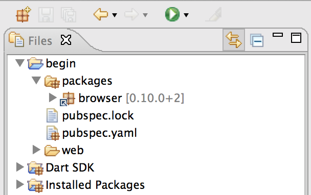
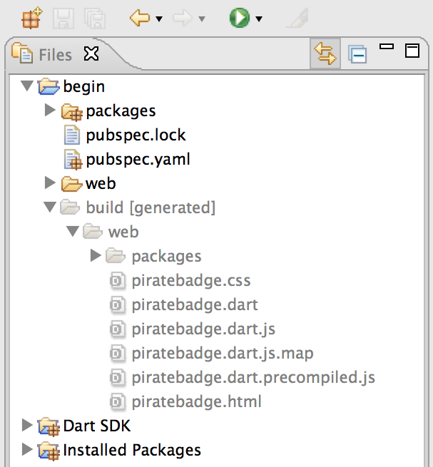

<toc-element></toc-element>

### Check out pubspec.yaml

&rarr; Double-click the `pubspec.yaml` file to open it.
Click the **Source** tab at the bottom of the editing pane.

    name: avast_ye_pirates
    description: Write a Dart web app code lab
    dependencies:
      browser: any

Key information:

* A `pubspec.yaml` file in a directory identifies the directory
  and its contents as an application.

* `pubspec.yaml` provides metadata for the application,
  such as its name.

* The `pubspec.yaml` file also lists the packages on which the app depends.
  The `browser` library needed by this app is hosted in a package on
  [pub.dartlang.org](https://pub.dartlang.org/) along with many others.

* `any` selects the latest package that matches your SDK.

### Look at the packages directory

&rarr; In Dart Editor, expand the `packages` directory.

<figure>
  
  <figcaption>The `packages` directory points to the code for the packages your app depends on</figcaption>
</figure>

Key information:

*  The `packages` directory points to the code for all of the dependencies
   listed in the `pubspec.yaml` file.
   These are installed automatically by Dart Editor.

* The `browser` package contains the `dart.js` script
  that checks for native Dart support.

* The packages must be included in the built application
  in order for the app to be successfully deployed.

### Run pub build

&rarr; Select `pubspec.yaml`
then select **Tools > Pub Build (generates JS)**,
which builds everything under the `begin` directory.
The output looks something like this:

    --- 8:33:02 PM Running pub build on <home_dir>/codelabs/begin ... ---
    Loading source assets... (0.4s)
    Building avast_ye_pirates... (0.0s)
    [Info from Dart2JS]:
    Compiling avast_ye_pirates|web/piratebadge.dart...
    [Info from Dart2JS]:
    Took 0:00:01.542683 to compile avast_ye_pirates|web/piratebadge.dart.
    Built 365 files to "build".

Key information:

* The `pub build` command creates a `build` directory that contains
  everything needed to deploy the app.

### Look at the `build` directory

&rarr; Expand the `build` directory and its `web` subdirectory.

<figure>
  
  <figcaption>The build directory contains everything you need to deploy</figcaption>
</figure>

Key information:

* The `piratebadge.dart.js` file is a JavaScript file that has been minified.
  When deployed, this file runs in the browser.

* The `packages` directory contains the package dependencies.

* Note that the directory contains no `piratebadge.dart` file.
  It is not needed to deploy the app to JavaScript.

### Run the app as JavaScript

&rarr; Right click the `piratebadge.html` file under `build/web`,
and choose **Run in Browser** from the menu.

  

    <b>Note:</b> Run in Browser is currently not working,
    due to kiosk security restrictions.
    We're working on it...
  

  

    &rarr;
    Copy the URL and run the app in another modern browser
    such as Firefox or Safari.
  

Key information:

* The app runs on localhost.
  To share your app with others,
  you need to deploy the app to a hosting service.
