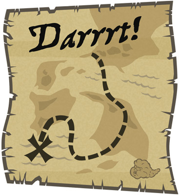

<toc-element></toc-element>

### Take the Polymer Dart codelab

This codelab used old-school HTML APIs to build its UI,
but you have other options, such as Polymer.
For an introduction to using Polymer elements in Dart apps,
check out the following codelab:

[Polymer: Build an Admin Console Using Dart](/static/codelabs/polymer-and-dart/)

### Deploy a server and your app

If you're interested in server-side programming,
see the following tutorial:

[Write HTTP Clients & Servers](https://www.dartlang.org/docs/tutorials/httpserver/)

### Check out the samples

Run some Dart programs online and check out their source code:

[Dart Code Samples](https://www.dartlang.org/samples/)

### Read the tutorials

Learn more about Dart:

[The Dart Tutorials](https://www.dartlang.org/docs/tutorials/)

