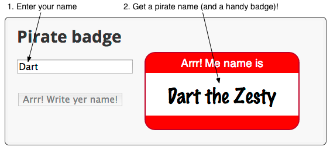
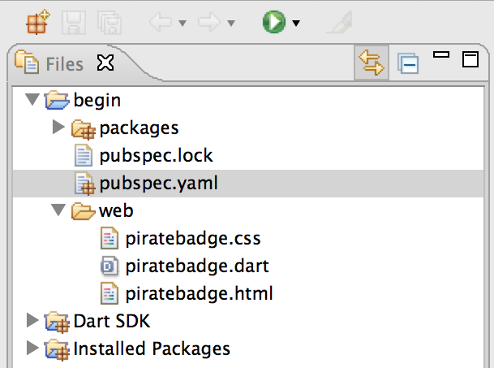
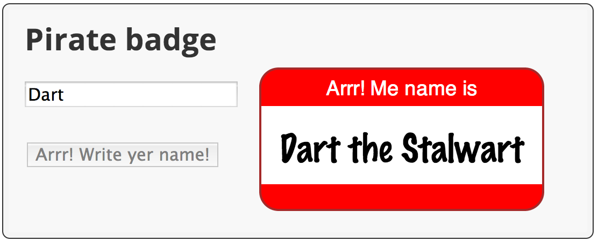
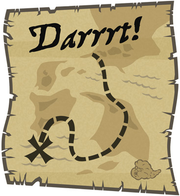

<toc-element></toc-element>

This codelab features a simple app
that produces a name badge,
suitable for wear at a pirate convention.
The point is not to dazzle you with the app's appearance or features,
but to teach you about the Dart language, core libraries, and tools.

<figure>
  
  <figcaption>The final app</figcaption>
</figure>

Now that you know what you'll be building,
it's time to get the code
and take a look at it.

### Start the editor

Throughout this codelab,
you use Dart Editor to edit and run your web app.

  

    &rarr; If you don't already have Dart Editor, download it by
    clicking the <b>Download Dart + Editor</b> button
    on the following page:
  

  <blockquote>
    <a href="https://www.dartlang.org/tools/download.html"
    target="_blank"><b>Dart download page</b></a>
  </blockquote>

  &rarr; Start Dart Editor.
  If you have problems, see
  <a href="https://www.dartlang.org/tools/editor/troubleshoot.html"
  target="_blank">Troubleshooting Dart Editor</a>.

  
&rarr; Start Dart Editor by clicking the Dart logo
  at the bottom of your computer screen:

  

### Open the sample app

&rarr; In Dart Editor,
use **File > Open Existing Folder...**
to open the <b><io-location-string noclone="true"></io-location-string></b> directory.

 

<figure>
  
  <figcaption><io-location-string noclone="true"></io-location-string> contains the files and directories for your app.</figcaption>
</figure>

<aside class="callout">
<b>Note:</b>
If you see red Xs at the left of the
filenames or if the <code>packages</code> directory is missing,
the packages are not properly installed.
Right-click <code>pubspec.yaml</code> and select <b>Pub Get</b>.
</aside>

Key information:

* The `packages` directory, `pubspec.yaml`, and `pubspec.lock` are
  related to package dependencies.
  This project has all the dependencies set up for you.
  Dart Editor automatically installs the necessary packages.

* **Dart SDK** contains the source code for all of the functions,
  variables, and classes provided by the Dart Software Development Kit.

* **Installed Packages** contains the source code for all of the functions,
  variables, and classes for the additional libraries that this application depends on.
<toc-element></toc-element>

### Look in the web directory

&rarr; In Dart Editor, expand the **`begin`** directory
and then the **`web`** directory
by clicking the little arrows
 to the left of their names.

The `web` directory contains `piratebadge.html`, `piratebadge.dart`,
and `piratebadge.css`.

### Open the files

&rarr;  Open `piratebadge.html` and `piratebadge.dart`,
by double-clicking each filename in Dart Editor.

### Review the code

&rarr; Get familiar with the HTML and the Dart code for the skeleton version of the app.

#### piratebadge.html

    <html>
      <head>
        <meta charset="utf-8">
        <title>Pirate badge</title>
        <meta name="viewport"
              content="width=device-width, initial-scale=1.0">
        <link rel="stylesheet" href="piratebadge.css">
      </head>
      <body>
        <h1>Pirate badge</h1>
        
        

          TO DO: Put the UI widgets here.
        

        

          

            Arrr! Me name is
          

          

             
          

        

        
        
      </body>
    </html>

Key information:

* During this code lab,
  all the changes you make to `piratebadge.html` are within
  the &lt;div&gt; element identified with the class `widgets`.

* In later steps,
  the &lt;span&gt; element with the ID `badgeName`
  is programmatically updated by the Dart code
  based on user input.

* The first &lt;script&gt; tag identifies
  the main file that implements the app.
  Here, it's the `piratebadge.dart` file.

* The Dart Virtual Machine (Dart VM) runs Dart code natively.
  The Dart VM is built into Dartium,
  a special build of the Chromium browser in which you can run Dart apps natively.

* The `packages/browser/dart.js` script checks for native Dart support
  and either bootstraps the Dart VM or loads compiled JavaScript instead.

#### piratebadge.dart

    void main() {
      // Your app starts here.
    }

Key information:

* This file contains the single entry point for the app&mdash;the `main()` function.
  The &lt;script&gt; tags in the `piratebadge.html` file start the application
  by running this function.

* The `main()` function is a top-level function.

* A top-level variable or function is one that is declared outside
  a class definition.

### Run the app

&rarr; In Dart Editor, right-click `piratebadge.html`
and select **Run in Dartium**.

<figure>
  
  <figcaption>Select Run in Dartium</figcaption>
</figure>

<b>Note:</b> The first time you run the app, you might see a dialog
asking if it's OK for a remote device to connect to and run your Dart apps.
Click <b>OK</b>.

Dart Editor launches _Dartium_, a special build of Chromium
that has the Dart Virtual Machine built in,
and loads the `piratebadge.html` file.
The `piratebadge.html` file loads the app
and calls the `main()` function.

You should see a TO DO comment on the left
and a red and white name badge on the right.

<figure>
  
  <figcaption>Your running app should look like this</figcaption>
</figure>
<toc-element></toc-element>

<aside class="callout">
<strong>Note:</strong> Throughout this code lab,
continue to <strong>edit the files in <code>begin</code>.</strong>
You can use the files in the other directories to compare to your code
or to recover if you get off track.
</aside>

### Edit piratebadge.html

&rarr; Add a new &lt;div> containing an &lt;input&gt; tag to the HTML code
within the `widgets` &lt;div&gt;.

    ...
    

      

        <input type="text" id="inputName" maxlength="15">
      

    

    ...

Key information:

* The ID for the input element is `inputName`.
Dart uses CSS selectors, such as `#inputName`,
to get elements from the DOM.

### Edit piratebadge.dart

&rarr; Import the `dart:html`
library at the top of `piratebadge.dart`
(below the copyright).

    import 'dart:html';

Key information:

* This imports _all_ classes and other resources from dart:html.

* Don't worry about bloated code.
  The build process performs tree-shaking to help minimize code.

* The dart:html library contains the classes for all DOM element types,
  in addition to functions for accessing the DOM.

* Later you'll use import with the `show` keyword,
  which imports only the specified classes.

* Dart Editor helpfully warns you that the import is unused.
  Don't worry about it. You'll fix it in the next step.

&rarr; Register a function named `updateBadge`
to handle input events on the input field.

    // In main():
    querySelector('#inputName').onInput.listen(updateBadge);

Key information:

* The `querySelector()` function, defined in
  dart:html, gets the specified element from the DOM.
  Here, the code uses the selector `#inputName`
  to specify the input field.

* The object returned from `querySelector()` 
  _is_ the DOM element object.

* Mouse and keyboard events are served over a stream.

* A Stream provides an asynchronous sequence of data.
  Using the `listen()` method, a stream client
  registers a callback function that gets called when
  data is available.

* `onInput.listen()` listens to the text field's event stream for input events.
  When such an event occurs, `updateBadge()` is called.

* An input event occurs when the user presses a key.

* You can use either single or double quotes to create a string.

* Dart Editor warns you that the function doesn't exist.
  Let's fix that now.

&rarr; Implement the event handler.
You can put this function at the end of `piratebadge.dart`.

    ...

    void updateBadge(Event e) { 
      querySelector('#badgeName').text = e.target.value;
    }

Key information:

* This function sets the text of the `badgeName` element from the value of the input field.

* `Event e` is the argument to the updateBadge function.
  The argument's name is `e`; its type is `Event`.

* You can tell that `updateBadge()` is an event handler because
  its parameter is an `Event` object.

* The element that generated the event, the input field, is `e.target`.

* Note the warning symbol next to this line of code in Dart Editor.
  `e.target` is typed as an `EventTarget`,
   which does not have a `value` property.

&rarr; Remove the warning by specifying a type for `e.target`.

    void updateBadge(Event e) { 
      querySelector('#badgeName').text =
          (e.target as InputElement).value;
    }

Key information:

* In this example, `e.target` is the input element
  that generated the event.

* The `as` keyword typecasts `e.target` to an
  `InputElement` to silence warnings from Dart Editor.

### Run the app

&rarr; Save your files with **File > Save All**.

&rarr; Run the app by right-clicking `piratebadge.html` and
selecting **Run in Dartium**.

&rarr; Compare your app to this screenshot.

<figure>
  
  <figcaption>Your app should look like this</figcaption>
</figure>

&rarr; Type in the input field.

The text you type should also appear in the badge.

#### Problems?

Check your code against the files in <io-location-string noclone="true" starterpath="/step3"></io-location-string>.
<toc-element></toc-element>

### Edit piratebadge.html

&rarr; Add a &lt;button&gt; tag below the input field.

    ...
    <!-- In the "widgets" div -->
      ...
      <!-- Add a button div *after* the input element's div -->
      

        <button id="generateButton">Aye! Gimme a name!</button>
      

    
 <!-- end of the "widgets" div -->
    ...

Key information:

* The button has the ID `generateButton` so
the Dart code can get the element.

### Edit piratebadge.dart

&rarr; Below the import, declare a top-level variable to hold the `ButtonElement`.

    import 'dart:html';

    ButtonElement genButton;

Key information:

* ButtonElement is one of many different kinds of DOM elements
provided by the dart:html library.

* Variables, including numbers, initialize to null if no value is provided.

&rarr; Wire up the button with an event handler.

    void main() {
      ...
      genButton = querySelector('#generateButton');
      genButton.onClick.listen(generateBadge);
    }

Key information:

* `onClick` registers a mouse click handler.

&rarr; Add a top-level function that changes the name on the badge.

    ...

    void setBadgeName(String newName) {
      querySelector('#badgeName').text = newName;
    }

Key information:

* The function updates the HTML page with a new name.

&rarr; Implement the click handler for the button.

    ...

    void generateBadge(Event e) {
      setBadgeName('Anne Bonney');
    }

Key information:

* This function sets the badge name to `Anne Bonney`.

&rarr; Modify `updateBadge()` to call `setBadgeName()`.

    void updateBadge(Event e) {
      String inputName = (e.target as InputElement).value;
      setBadgeName(inputName);
    }

Key information:

* Assign the input field's value to a local string.

&rarr; Add a skeleton if-else statement to `updateBadge()`.

    void updateBadge(Event e) {
      String inputName = (e.target as InputElement).value;
      setBadgeName(inputName);
      if (inputName.trim().isEmpty) {
        // To do: add some code here.
      } else {
        // To do: add some code here.
      }
    }

Key information:

* The `String` class has useful functions and properties 
for working with string data,
such as `trim()` and `isEmpty`.

* String comes from the `dart:core` library,
which is automatically imported into every Dart program.

* Dart has common programming language constructs like `if`-`else`.

&rarr; Now fill in the if-else statement to modify the button as needed.

    void updateBadge(Event e) {
      String inputName = (e.target as InputElement).value;
      setBadgeName(inputName);
      if (inputName.trim().isEmpty) {
        genButton..disabled = false
                 ..text = 'Aye! Gimme a name!';
      } else {
        genButton..disabled = true
                 ..text = 'Arrr! Write yer name!';
      }
    }

Key information:

* The cascade operator (`..`) allows you to perform multiple
operations on the members of a single object. 

* The `updateBadge()` code uses the cascade operator
to set two properties on the button element.
The result is the same as this more verbose code:

    genButton.disabled = false;
    genButton.text = 'Aye! Gimme a name!';

### Run the app

&rarr; Save your files with **File > Save All**.

&rarr; Run the app by right-clicking `piratebadge.html` and
selecting **Run in Dartium**.

&rarr; Compare your app to this screenshot.

<figure>
  
  <figcaption>Your app should look like this</figcaption>
</figure>

&rarr; Type in the input field.
Remove the text from the input field.
Click the button.

#### Problems?

Check your code against the files in <io-location-string noclone="true" starterpath="/step4"></io-location-string>.
<toc-element></toc-element>

### Edit piratebadge.dart

&rarr; Add an import to the top of the file.

    import 'dart:html';
    import 'dart:math' show Random;

Key information:

* Using the `show` keyword,
you can import only the classes, functions, or properties you need.

* `Random` provides a random number generator.

&rarr; Add a class declaration to the bottom of the file.

    ...

    class PirateName {
    }

Key information:

* The class declaration provides the class name.

&rarr; Create a class-level Random object.

    class PirateName {
      static final Random indexGen = new Random();
    }

Key information:

* `static` defines a class-level field. That is,
the random number generator is shared with all
instances of this class.

* Dart Editor italicizes the names of class-level fields and methods.

* Use `new` to call a constructor.

&rarr; Add two instance variables to the class—one
for the first name and one for the appellation.

    class PirateName {
      static final Random indexGen = new Random();
      String _firstName;
      String _appellation;
    }

Key information:

* Private variables start with underscore (`_`).
  Dart has no `private` keyword.

&rarr; Create two static lists within the class
that provide a small collection of names and appellations to choose from.

    class PirateName {
      ...
      static final List names = [
        'Anne', 'Mary', 'Jack', 'Morgan', 'Roger',
        'Bill', 'Ragnar', 'Ed', 'John', 'Jane' ];
      static final List appellations = [
        'Jackal', 'King', 'Red', 'Stalwart', 'Axe',
        'Young', 'Brave', 'Eager', 'Wily', 'Zesty'];
    }

Key information:

* `final` variables cannot change.

* Lists are built into the language.
These lists are created using list literals.

* The `List` class provides the API for lists.

&rarr; Provide a constructor for the class.

    class PirateName {
      ...
      PirateName({String firstName, String appellation}) {
        if (firstName == null) {
          _firstName = names[indexGen.nextInt(names.length)];
        } else {
          _firstName = firstName;
        }
        if (appellation == null) {
          _appellation = appellations[indexGen.nextInt(appellations.length)];
        } else {
          _appellation = appellation;
        }
      }
    }

Key information:

* Constructors have the same name as the class.

* The parameters enclosed in curly brackets (`{` and `}`)
are optional, named parameters.

* The `nextInt()` function gets a new random integer
from the random number generator.

* Use square brackets (`[` and `]`) to index into a list.

* The `length` property returns the number of items in a list.

* The code uses a random number as an index into the list.

&rarr; Provide a getter for the pirate name.

    class PirateName {
      ...
      String get pirateName =>
        _firstName.isEmpty ? '' : '$_firstName the $_appellation';
    }

Key information:

* Getters are special methods that provide read access to an object’s properties.

* The ternary operator `?:` is short-hand for an if-then-else statement.

* String interpolation
(`'$_firstName the $_appellation'`)
lets you easily build strings from other objects.

* The fat arrow (` => expr; `) syntax is a shorthand for `{ return expr; }`.

&rarr; Modify the function `setBadgeName()` to use a PirateName instead of a String:

    void setBadgeName(PirateName newName) {
      querySelector('#badgeName').text = newName.pirateName;
    }

Key information:

* This code calls the getter to get the PirateName as a string.

&rarr; Change `updateBadge()` to generate a PirateName based on the input field value.

    void updateBadge(Event e) {
      String inputName = (e.target as InputElement).value;
      
      setBadgeName(new PirateName(firstName: inputName));
      ...
    }

Key information:

* The call to the constructor provides a value for one optional named parameter.

&rarr; Change `generateBadge()` to generate a PirateName instead of using `Anne Bonney`.

    void generateBadge(Event e) {
      setBadgeName(new PirateName());
    }

Key information:

* In this case, the call to the constructor passes no parameters.

### Run the app

&rarr; Save your files with **File > Save All**.

&rarr; Run the app by right-clicking `piratebadge.html` and
selecting **Run in Dartium**.

&rarr; Compare your app to the one in this screenshot.

<figure>
  
  <figcaption>Your app should look like this</figcaption>
</figure>

&rarr; Type in the input field.
Remove the text from the input field.
Click the button.

#### Problems?

Check your code against the files in <io-location-string noclone="true" starterpath="/step5"></io-location-string>.
<toc-element></toc-element>

### Edit piratebadge.dart

&rarr; Import the JSON converter from the `dart:convert` library.

    import 'dart:html';
    import 'dart:math' show Random;
    import 'dart:convert' show JSON;

Key information:

* `JSON` provides convenient access to the most common JSON use cases.

&rarr; Add a named constructor to the PirateName class.

    class PirateName {
      ...
      PirateName.fromJSON(String jsonString) {
        Map storedName = JSON.decode(jsonString);
        _firstName = storedName['f'];
        _appellation = storedName['a'];
      }
    }

Key information:

* The constructor creates a new PirateName instance from a JSON-encoded string.

* `PirateName.fromJson` is a named constructor.

* `JSON.decode()` parses a JSON string and creates Dart objects from it.

* The pirate name is decoded into a `Map` object.

&rarr; Add a getter to the PirateName class
that encodes a pirate name in a JSON string.

    class PirateName {
      ...
      String get jsonString => JSON.encode({"f": _firstName, "a": _appellation});
    }

Key information:

* The getter formats the JSON string using the map format.

&rarr; Declare a **top-level** string.

    final String TREASURE_KEY = 'pirateName';

    void main() {
      ...
    }

Key information:

* You store key-value pairs in local storage. This string is the key.
The value is the pirate name.

&rarr; Save the pirate name when the badge name changes.

    void setBadgeName(PirateName newName) {
      if (newName == null) {
        return;
      }
      querySelector('#badgeName').text = newName.pirateName;
      window.localStorage[TREASURE_KEY] = newName.jsonString;
    }

Key information:

* Local storage is provided by the browser's `Window`.

&rarr; Add a top-level function called `getBadgeNameFromStorage()`.

    void setBadgeName(PirateName newName) {
      ...
    }

    PirateName getBadgeNameFromStorage() {
      String storedName = window.localStorage[TREASURE_KEY];
      if (storedName != null) {
        return new PirateName.fromJSON(storedName);
      } else {
        return null;
      }
    }

Key information:

* The function retrieves the pirate name from local storage
and creates a PirateName object from it.

&rarr; Call the function from the `main()` function.

    void main() {
      ...
      setBadgeName(getBadgeNameFromStorage());
    }

Key information:

* Initialize the badge name from local storage.

### Run the app

&rarr; Save your files with **File > Save All**.

&rarr; Run the app by right-clicking `piratebadge.html` and
selecting **Run in Dartium**.

&rarr; Click the button to put a name on the badge.

&rarr; Start the app again by duplicating the app's window.
(Right-click the tab and choose **Duplicate**.)
Instead of starting up blank,
it should contain the same name and appellation
as the first copy of the app displays.

#### Problems?

Check your code against the files in <io-location-string noclone="true" starterpath="/step6"></io-location-string>.
<toc-element></toc-element>

### Create piratenames.json

&rarr; Use **File > New File...** to create a JSON-encoded file
named `piratenames.json` with the following content.

Put the file in `web` alongside the Dart and HTML files you've been editing.

    { "names": [ "Anne", "Bette", "Cate", "Dawn",
            "Elise", "Faye", "Ginger", "Harriot",
            "Izzy", "Jane", "Kaye", "Liz",
            "Maria", "Nell", "Olive", "Pat",
            "Queenie", "Rae", "Sal", "Tam",
            "Uma", "Violet", "Wilma", "Xana",
            "Yvonne", "Zelda",
            "Abe", "Billy", "Caleb", "Davie",
            "Eb", "Frank", "Gabe", "House",
            "Icarus", "Jack", "Kurt", "Larry",
            "Mike", "Nolan", "Oliver", "Pat",
            "Quib", "Roy", "Sal", "Tom",
            "Ube", "Val", "Walt", "Xavier",
            "Yvan", "Zeb"],
      "appellations": [ "Awesome", "Captain",
            "Even", "Fighter", "Great", "Hearty",
            "Jackal", "King", "Lord",
            "Mighty", "Noble", "Old", "Powerful",
            "Quick", "Red", "Stalwart", "Tank",
            "Ultimate", "Vicious", "Wily", "aXe", "Young",
            "Brave", "Eager",
            "Kind", "Sandy",
            "Xeric", "Yellow", "Zesty"]}

Key information:

* The file contains a JSON-encoded map,
which contains two lists of strings.

### Edit piratebadge.html

&rarr; Disable the input field and the button
by adding a `disabled` attribute to the `<input>` and `<button>` tags.

    ...
      

        <input type="text" id="inputName" maxlength="15" disabled>
      

      

        <button id="generateButton" disabled>Aye! Gimme a name!</button>
      

    ...

Key information:

* The Dart code enables the text field and
the button after the pirate names are successfully read from
the JSON file.

### Edit piratebadge.dart

&rarr; Import the dart:async library.

    import 'dart:html';
    import 'dart:math' show Random;
    import 'dart:convert' show JSON;
    import 'dart:async' show Future;

Key information:

* The `dart:async` library provides for asynchronous programming.

* A `Future` provides a way to get a value in the future.
  (If you're a JavaScript developer: Futures are similar to Promises.)

&rarr; Replace the `names` and `appellations` lists with these static, empty lists:

    class PirateName {
      ...
      static List<String> names = [];
      static List<String> appellations = [];
      ...
    }

Key information:

* **Be sure to remove `final` from these declarations.**

* `[]` is equivalent to `new List()`.

* A List is a _generic_ type&mdash;a List can contain any kind of object.
If you intend for a list to contain only strings,
you can declare it as `List<String>`.

&rarr; Add two static functions to the PirateName class:

    class PirateName {
      ...

      static Future readyThePirates() {
        var path = 'piratenames.json';
        return HttpRequest.getString(path)
            .then(_parsePirateNamesFromJSON);
      }
      
      static _parsePirateNamesFromJSON(String jsonString) {
        Map pirateNames = JSON.decode(jsonString);
        names = pirateNames['names'];
        appellations = pirateNames['appellations'];
      }
    }

Key information:

* `HttpRequest` is a utility for retrieving data from a URL.

* `getString()` is a convenience method for doing a simple
GET request that returns a string.

* The code uses a `Future` to perform the GET asynchronously.

* The callback function for `.then()` is called when
the Future completes successfully.

* When the Future completes successfully,
the pirate names are read from the JSON file.

* `readyThePirates` returns the Future so the main program has the
opportunity to do something after the file is read.

&rarr; Add a top-level variable.

    SpanElement badgeNameElement;

    void main() {
      ...
    }

Key information:

* Stash the span element for repeated use instead of querying the DOM for it.

&rarr; Change the `main()` function to stash the input and span elements,
and to get names from the JSON file.

After these changes, `main()` should look like this:

    void main() {
      InputElement inputField = querySelector('#inputName');
      inputField.onInput.listen(updateBadge);
      genButton = querySelector('#generateButton');
      genButton.onClick.listen(generateBadge);
      
      badgeNameElement = querySelector('#badgeName');
      
      PirateName.readyThePirates()
        .then((_) {
          //on success
          inputField.disabled = false; //enable
          genButton.disabled = false;  //enable
          setBadgeName(getBadgeNameFromStorage());
        })
        .catchError((arrr) {
          print('Error initializing pirate names: $arrr');
          badgeNameElement.text = 'Arrr! No names.';
        });
    }

Key information:

* Stash the input element in a local variable (`inputField`).
* Stash the span element in the global variable (`badgeNameElement`).
* The `readyThePirates()` function returns a Future.
* When the Future successfully completes,
the `then()` callback function is called.
* Using underscore (`_`) as a parameter name
indicates that the parameter is ignored.
* The callback function enables the UI
and gets the stored name.
* If the Future encounters an error
the `catchError()` callback function is called
and the program displays an error message,
leaving the UI disabled.
* The callback functions for `then()` and `catchError()` are defined inline.

### Run the app

&rarr; Save your files with **File > Save All**.

&rarr; Run the app by right-clicking `piratebadge.html` and
selecting **Run in Dartium**.

&rarr; If you want to see what happens when the app can't find the `.json` file,
change the file name in the code and run the program again.

&rarr; Your app should look like it did before,
but with a bigger pool of names and appellations.

#### Problems?

Check your code against the files in <io-location-string noclone="true" starterpath="/step7"></io-location-string>.
<toc-element></toc-element>

### Check out pubspec.yaml

&rarr; Double-click the `pubspec.yaml` file to open it.
Click the **Source** tab at the bottom of the editing pane.

    name: avast_ye_pirates
    description: Write a Dart web app code lab
    dependencies:
      browser: any

Key information:

* A `pubspec.yaml` file in a directory identifies the directory
  and its contents as an application.

* `pubspec.yaml` provides metadata for the application,
  such as its name.

* The `pubspec.yaml` file also lists the packages on which the app depends.
  The `browser` library needed by this app is hosted in a package on
  [pub.dartlang.org](https://pub.dartlang.org/) along with many others.

* `any` selects the latest package that matches your SDK.

### Look at the packages directory

&rarr; In Dart Editor, expand the `packages` directory.

<figure>
  
  <figcaption>The `packages` directory points to the code for the packages your app depends on</figcaption>
</figure>

Key information:

*  The `packages` directory points to the code for all of the dependencies
   listed in the `pubspec.yaml` file.
   These are installed automatically by Dart Editor.

* The `browser` package contains the `dart.js` script
  that checks for native Dart support.

* The packages must be included in the built application
  in order for the app to be successfully deployed.

### Run pub build

&rarr; Select `pubspec.yaml`
then select **Tools > Pub Build (generates JS)**,
which builds everything under the `begin` directory.
The output looks something like this:

    --- 8:33:02 PM Running pub build on <home_dir>/codelabs/begin ... ---
    Loading source assets... (0.4s)
    Building avast_ye_pirates... (0.0s)
    [Info from Dart2JS]:
    Compiling avast_ye_pirates|web/piratebadge.dart...
    [Info from Dart2JS]:
    Took 0:00:01.542683 to compile avast_ye_pirates|web/piratebadge.dart.
    Built 365 files to "build".

Key information:

* The `pub build` command creates a `build` directory that contains
  everything needed to deploy the app.

### Look at the `build` directory

&rarr; Expand the `build` directory and its `web` subdirectory.

<figure>
  
  <figcaption>The build directory contains everything you need to deploy</figcaption>
</figure>

Key information:

* The `piratebadge.dart.js` file is a JavaScript file that has been minified.
  When deployed, this file runs in the browser.

* The `packages` directory contains the package dependencies.

* Note that the directory contains no `piratebadge.dart` file.
  It is not needed to deploy the app to JavaScript.

### Run the app as JavaScript

&rarr; Right click the `piratebadge.html` file under `build/web`,
and choose **Run in Browser** from the menu.

  

    <b>Note:</b> Run in Browser is currently not working,
    due to kiosk security restrictions.
    We're working on it...
  

  

    &rarr;
    Copy the URL and run the app in another modern browser
    such as Firefox or Safari.
  

Key information:

* The app runs on localhost.
  To share your app with others,
  you need to deploy the app to a hosting service.
<toc-element></toc-element>

### Take the Polymer Dart codelab

This codelab used old-school HTML APIs to build its UI,
but you have other options, such as Polymer.
For an introduction to using Polymer elements in Dart apps,
check out the following codelab:

[Polymer: Build an Admin Console Using Dart](/static/codelabs/polymer-and-dart/)

### Deploy a server and your app

If you're interested in server-side programming,
see the following tutorial:

[Write HTTP Clients & Servers](https://www.dartlang.org/docs/tutorials/httpserver/)

### Check out the samples

Run some Dart programs online and check out their source code:

[Dart Code Samples](https://www.dartlang.org/samples/)

### Read the tutorials

Learn more about Dart:

[The Dart Tutorials](https://www.dartlang.org/docs/tutorials/)

